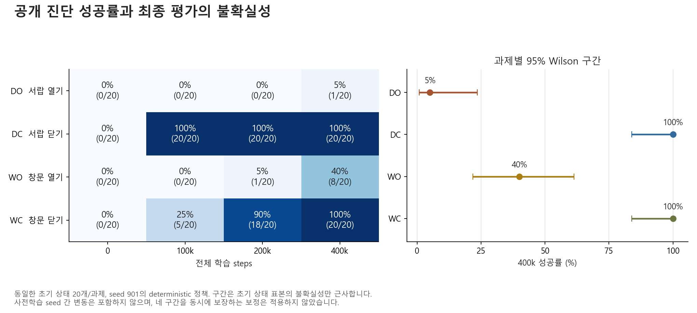
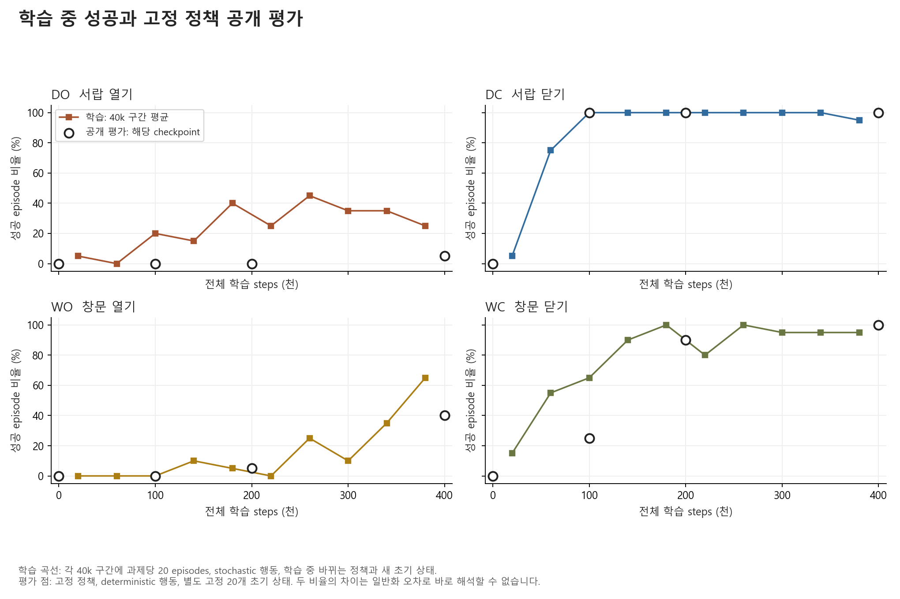

# P0 사전학습 결과 분석 v1

분석일: 2026-10-07. **학습과 저장·복원은 정상 수행되었고, 사전에 정한 추가 연습 배분 파일럿의 진입 조건을 충족했다. 다만 네 과제의 숙련도는 크게 다르다.** 400k 공개 진단 평균 성공률은 61.25%지만, 서랍 열기는 5%, 창문 열기는 40%다. 모든 과제를 충분히 익혔거나 학습이 수렴했다고 판단할 근거는 없다. 연습 배분을 바꿨을 때의 이득은 아직 측정하지 않았다.

원본은 [02의 완료된 실행](../02_p0_uniform_pretraining_v1/results/20261007T060310Z_p0_cuda_50621c50/run/run_summary.json)이다. 이 폴더는 기존 실행을 읽어 분석하며, 01·02의 코드를 import하지 않는다. **이번 분석에서 추가 학습 steps와 추가 평가 episodes는 모두 0**이다. 기존 코드, checkpoint, 평가 bank, 선택 규칙은 보존했다.

최종 분석 산출물은 [20261007T072545Z_59ce9919](results/20261007T072545Z_59ce9919/analysis_manifest.json)이다. 앞선 `20261007T072120Z_65471c72` 실행도 보존했다. 최종 실행에는 중간 속도 로그 오류의 검사와 그림 범례 위치 보정이 추가되었다.

**1. 실행 규모와 평가 기준**

| 항목 | 실제 실행 |
| --- | --- |
| 원래 사전학습 seed | 901 하나 |
| 정책 | 과제 ID를 입력받는 공유 SAC actor 1개, critic 2개 |
| 관측·행동 | 상태 39차원 + 과제 one-hot 4차원, 행동 4차원 |
| 네트워크·보상 | 은닉층 256×256, 환경 기본 dense reward, 정규화 없음 |
| 전체 학습 | 400,000 transitions, 800 episodes |
| 과제별 학습 | 각각 100,000 transitions, 200 episodes |
| 학습 길이·배분 | episode당 500 steps, 8 episodes마다 과제별 2개 |
| 업데이트 | 초기 1,000 steps 이후 399,000 SAC iterations, batch 256 |
| Replay 용량 | 100,000 transitions |
| 진단 시점 | 0 / 100k / 200k / 400k 전체 학습 steps |
| 진단 표본 | 과제별 고정 초기 상태 20개, 총 80개를 네 시점에 재평가 |
| 평가 행동·성공 | deterministic, 500 steps 안에 공식 success가 한 번이라도 1 |

평가 로그는 320행이지만 **서로 다른 초기 상태는 80개**다. 시점별 결과는 같은 사례를 반복 평가한 짝지은 자료이며, 320개의 독립 표본으로 취급하지 않았다. 각 과제의 성공률을 25%씩 반영한 산술평균을 macro 성공률로 사용한다. 이 실험은 사용자 정의 네 과제 집합으로, 공식 MT10 벤치마크 재현이 아니다.

과제별 50개의 별도 결과 평가 초기 상태도 생성되어 있으나, 해당 bank의 정책 성능은 아직 평가하지 않았다. 선택 규칙에는 공개 진단만 사용했다. 성공률을 주지표로 삼고 episode 중 성공 신호를 집계하는 기준은 [MetaWorld 평가 문서](https://metaworld.farama.org/evaluation/evaluation/)를 따른다.

**2. 최종 성능과 학습 경과**

| 과제 | 학습 전 | 100k | 200k | 400k | 최종 판독 |
| --- | ---: | ---: | ---: | ---: | --- |
| DO 서랍 열기 | 0/20 (0%) | 0/20 (0%) | 0/20 (0%) | 1/20 (5%) | 가장 약한 과제 |
| DC 서랍 닫기 | 0/20 (0%) | 20/20 (100%) | 20/20 (100%) | 20/20 (100%) | 공개 진단에서 일찍 상한 도달 |
| WO 창문 열기 | 0/20 (0%) | 0/20 (0%) | 1/20 (5%) | 8/20 (40%) | 후반부에 개선, 실패도 많음 |
| WC 창문 닫기 | 0/20 (0%) | 5/20 (25%) | 18/20 (90%) | 20/20 (100%) | 중반부에 큰 개선 |
| **Macro** | **0%** | **31.25%** | **48.75%** | **61.25%** | 네 과제 동일 가중치 |



최종 성공은 49/80건이다. 남은 실패 31건은 서랍 열기 19건과 창문 열기 12건에 집중되어 있다. 따라서 평균 61.25%만으로 네 기술의 준비 상태를 판단하면 중요한 병목이 가려진다.

200k→400k에서 같은 사례를 대조하면 평균 개선 12.5%p 중 **8.75%p, 즉 70%는 창문 열기**에서 나왔다.

| 과제 | 새로 성공 | 이전 성공을 잃음 | 과제 성공률 변화 | Macro 개선 기여 |
| --- | ---: | ---: | ---: | ---: |
| DO | 1 | 0 | +5%p | +1.25%p |
| DC | 0 | 0 | 0%p | 0%p |
| WO | 7 | 0 | +35%p | +8.75%p |
| WC | 2 | 0 | +10%p | +2.50%p |

이 구간에는 공개 bank에서 성공을 잃은 사례가 없었다. 그러나 **100k→200k의 창문 닫기에서는 15건이 새로 성공하고 2건은 성공에서 실패로 바뀌었다.** 성공률은 25%→90%로 올랐지만 모든 초기 상태에서 단조롭게 좋아진 것은 아니다. 해당 두 사례는 400k에서 다시 성공했다. 이 사실만으로 과제 간 간섭이나 망각의 원인을 특정할 수는 없다.

근거: [과제별 진단 통계](results/20261007T072545Z_59ce9919/diagnostic_summary.csv), [짝지은 성공 변화](results/20261007T072545Z_59ce9919/paired_changes.csv), [개별 사례 그림](results/20261007T072545Z_59ce9919/03_paired_evaluation_cases.png).

**3. 서랍 열기의 병목: 경험 수 부족만으로는 설명되지 않는다**

네 과제는 정확히 같은 수의 환경 transitions를 수집했다. 실제 gradient update에 사용된 replay 표본도 누적으로 거의 균등했다. 아래 횟수는 중복 추출을 포함하므로 새로운 환경 경험 수가 아니다.

| 과제 | 수집 transitions | 학습 batch에서 추출된 횟수 | 누적 batch 비중 |
| --- | ---: | ---: | ---: |
| DO | 100,000 | 25,485,799 | 24.951% |
| DC | 100,000 | 25,595,918 | 25.059% |
| WO | 100,000 | 25,632,145 | 25.094% |
| WC | 100,000 | 25,430,138 | 24.896% |

따라서 서랍 열기만 replay에서 거의 제외되었다는 설명은 자료와 맞지 않는다. 다만 경험 수가 같아도 보상 크기, gradient 크기, 유효한 성공 경험의 질은 같지 않을 수 있다. 이 실행에는 과제별 gradient나 행동 영상이 없으므로 물리적인 실패 동작, 보상 문제, 공유 네트워크의 간섭을 확정하지 않는다.

학습 중 성공과 고정 정책 평가는 다음처럼 달랐다.

| 과제 | 마지막 100k 학습 중 성공, 과제당 50 episodes | 최종 공개 평가, 과제당 20 episodes |
| --- | ---: | ---: |
| DO | 14/50 (28%) | 1/20 (5%) |
| DC | 49/50 (98%) | 20/20 (100%) |
| WO | 20/50 (40%) | 8/20 (40%) |
| WC | 47/50 (94%) | 20/20 (100%) |



서랍 열기에서는 학습 중 성공 경험이 존재했지만, deterministic 평가에서 안정적으로 재현되지는 않았다. 학습은 stochastic 행동이고 정책도 계속 변하며, 평가와 초기 상태도 다르다. **28%와 5%의 차이를 곧바로 일반화 오차나 탐색 문제의 증거로 해석할 수 없다.** 탐색 행동의 기여, deterministic 행동의 약점, 초기 상태 차이와 작은 표본 변동을 분리할 후속 진단이 필요하다.

창문 열기는 마지막 40k 학습 구간에서 13/20 (65%)까지 성공했다. 이는 후반에 변화가 이어졌다는 보조 관찰이다. 최종 deterministic 정책의 성공률이 65%라는 뜻은 아니며, 학습을 더 하면 특정 성공률에 도달한다는 예측도 아니다.

서랍 열기의 100k 구간별 평균 학습 return은 약 1,515→1,845→1,855→1,904로 증가했다. 성공률과 개선 정도가 일치하지 않으므로 dense return만으로 기술 습득을 판정하지 않는다. 과제별 보상 함수도 다르고, 평가는 성공하면 조기 종료하므로 과제 간 raw return이나 학습·평가 return을 그대로 비교하지 않는다.

근거: [실제 replay 노출](results/20261007T072545Z_59ce9919/replay_exposure.csv), [100k 구간별 학습 통계](results/20261007T072545Z_59ce9919/train_100k_windows.csv), [40k 구간별 학습 통계](results/20261007T072545Z_59ce9919/train_40k_windows.csv).

**4. 성공 속도와 평가 불확실성**

성공한 episode에 한정한 최종 성공 도달 step 중앙값은 DC 15, WC 52, WO 63, DO 316이다. 표본 수는 각각 20, 20, 8, 1이다. 특히 DO의 값은 한 사례뿐이다. WO 실패 12건은 모두 500 steps까지 실행되어 전체 episode 평균 길이는 337.65 steps다. 성공 사례만의 속도를 전체 능력으로 해석하면 실패가 가려진다.

| 과제 | 400k 성공률 | 근사 95% Wilson 구간 |
| --- | ---: | ---: |
| DO | 5% | 0.9–23.6% |
| DC | 100% | 83.9–100% |
| WO | 40% | 21.9–61.3% |
| WC | 100% | 83.9–100% |

이 구간은 한 학습 정책에 대해 초기 상태가 동일 분포에서 독립적으로 추출되었다고 보는 근사 구간이다. **사전학습 seed 간 변동을 포함하지 않으며, 네 과제에 대한 동시 95% 보장도 아니다.** 20/20은 이 bank의 관측 성공률이 100%라는 뜻이지 실제 분포에서 완전한 성공을 보장하지 않는다. 과제당 한 사례가 성공률 5%p를 바꾸므로 작은 차이에 대한 순위 판단도 조심해야 한다.

Wilson 식은 별도로 계산한 후 [SciPy의 Wilson 구현](https://docs.scipy.org/doc/scipy/reference/generated/scipy.stats._result_classes.BinomTestResult.proportion_ci.html)과 16개 과제·시점 조합 모두 대조했다. seed 하나의 점추정치를 학습 전반의 견고한 성능으로 확대하지 않는 해석은 [소수 반복 RL 평가에 관한 연구](https://arxiv.org/abs/2108.13264)와도 일치한다.

**5. 최적화와 구현 검증**

원자료 재계산과 무결성 확인에서 **68/68 검사가 통과**했다. 주요 범위는 800개 학습 episode의 길이·배분, 320개 평가 기록의 분모와 초기 상태 일치, 평가 bank 간 중복 여부, 업데이트·replay 계수, 원본·스냅샷 코드 hash, checkpoint 파일 hash, 기록된 복원 검증 결과, 소요 시간 합계다.

200k와 400k checkpoint에는 가중치뿐 아니라 optimizer, replay, entropy, 수집기와 RNG 상태가 포함되어 있다. P0 실행 당시 전체 상태 복원 일치 검증이 통과했고, 이번 분석에서 해당 파일 hash가 유지되었음을 확인했다. 이번 분석이 새로운 GPU 복원 시험을 수행한 것은 아니다.

기록된 warm-up 이후 loss와 TD error는 모두 finite였고 파라미터도 실제로 바뀌었다. 그러나 critic loss 중앙값은 100k 구간별로 5.92→23.63→21.87→25.29였으며 마지막 구간의 기록된 최대치는 325.18이었다. 최종 entropy coefficient는 0.114다. 이것은 업데이트가 수행되었다는 증거이며, loss가 줄어들어 수렴했다는 증거는 아니다. 이 지표들은 네 과제가 섞인 batch에서 측정되어 특정 과제의 실패 원인을 직접 알려주지 않는다.

**작은 진행 로그 오류 1건을 확인했다.** `uniform_block_audited` 이벤트가 직전 4k 블록의 시간을 누적하기 전에 출력되어 속도와 ETA를 과하게 낙관적으로 기록한다. 예를 들어 8k에서 해당 이벤트는 354.58 steps/s를 표시하지만 완료된 시간 장부로 계산한 값은 152.34 steps/s다. 이후 `train_*_completed` 이벤트와 최종 summary는 실제 시간 장부와 일치했다. 성공률·업데이트·배분·checkpoint에는 영향이 없으며 이 분석의 시간은 장부에서 재계산했다. 수정은 다음 구현 버전에 반영하고 완료된 02 소스는 보존한다.

근거: [검사 결과](results/20261007T072545Z_59ce9919/audit_checks.json), [로그 오류 기록](results/20261007T072545Z_59ce9919/audit_findings.json), [속도 대조표](results/20261007T072545Z_59ce9919/progress_timing_audit.csv), [최적화·노출 그림](results/20261007T072545Z_59ce9919/04_optimization_and_exposure.png).

**6. 비용**

| 항목 | 실측 |
| --- | ---: |
| 완료 시각 | 2026-10-07 15:59:45 KST |
| 전체 실행 | 56분 33초 |
| 순수 학습 구간 | 54분 30초, 122.33 transitions/s |
| 공개 진단 | 1분 52.82초, 108,436 transitions |
| 학습 + 평가 환경 transitions | 508,436 |
| 두 checkpoint 저장·복원 검증 단계 합계 | 약 0.588초 |
| PyTorch tensor 최대 할당량 | 약 73.12 MiB |

PyTorch 할당량은 GPU 전체 VRAM 사용량과 다르다. 평가 시간은 시간 장부의 단계 합계로 hash 검사 등 단계 내부 비용도 포함한다. 성공 후 조기 종료 덕분에 최대 160,000 평가 transitions 중 실제로는 108,436을 사용했다. 이 수치는 이번 실행의 비용이며 다른 정책의 평가 시간이 같다는 뜻은 아니다.

근거: [비용 표](results/20261007T072545Z_59ce9919/runtime_costs.csv), [원본 최종 summary](../02_p0_uniform_pretraining_v1/results/20261007T060310Z_p0_cuda_50621c50/run/run_summary.json).

**7. 추가 연습 배분 실험에 주는 의미**

분기점은 **200k로 이미 고정되어 있다.** [원래 설계](../LOCAL_PRACTICE_ALLOCATION_PILOT_DESIGN_20261007.md)는 200k, 400k 순서로 최소 두 과제에서 성공과 실패가 함께 관측되는 첫 checkpoint를 사용하도록 정했다. 200k의 WO 1/20, WC 18/20이 그 조건을 충족했다. 400k의 더 높은 평균을 보고 시작점을 바꾸지 않는다.

| 고정 규칙 | 200k에서의 선택 | 공개 진단 근거 |
| --- | --- | --- |
| Uniform | U | 균등 배분 |
| Failure | F_DO | DO 성공률 0%로 가장 낮음 |
| Progress | F_WC | 100k→200k WC가 +65%p로 가장 크게 개선 |

여기서 검증할 질문이 분명해진다. 실패율 규칙은 서랍 열기에, 최근 개선량 규칙은 창문 닫기에 예산을 더 준다. 어느 쪽이 실제로 전체 성능을 더 올리는지는 지금 자료로 판별할 수 없다.

세 가지 해석상 주의점이 있다.

- DO는 개선 여지가 크지만, 더 집중하면 쉽게 배운다는 증거는 없다. 균등 학습의 낮은 성과만으로 집중 연습의 한계효과를 알아낼 수 없다.
- WC는 이미 공개 진단에서 90%다. 이 수치에서 WC만 100%로 올리고 다른 과제는 그대로라면 macro 개선은 2.5%p다. 이는 **공개 bank 기준의 직접 개선 여지**이며, 아직 평가하지 않은 결과 bank의 성능 상한이나 다른 과제로의 전이 효과를 뜻하지 않는다.
- WO는 200k→400k에서 좋아졌지만 그 구간은 추가 200k steps다. 예정된 분기 예산 40k의 다섯 배이므로, 이 결과로 F_WO가 40k 예산에서도 최선이라고 결론 내리지 않는다. 400k에서 계산된 Progress의 F_WO 추천은 참고 기록이며 200k의 고정 추천을 대체하지 않는다.

또한 기존 replay 100k에서 추가 수집 40k를 수행하면 마지막에도 과거 경험이 60% 남는다. 강조 과제의 새 수집 비중 62.5%를 바로 전체 학습 batch 비중으로 읽으면 안 된다. 균등한 기존 replay와 균등 추출을 가정하면 마지막의 강조 과제 비중은 `0.6×25% + 0.4×62.5% = 40%`, 분기 기간 평균은 선형 교체 근사에서 약 32.5%다. 이는 아직 실행하지 않은 분기에 대한 계산상 예상이며 실제 batch 계수로 확인해야 한다.

**판단:** 현재 P0는 정해 둔 소규모 배분 비교를 진행할 기술적 조건을 갖췄다. 반면 네 기술이 고르게 준비되었다거나 연습 배분의 효과가 입증되었다고 볼 수는 없다. 지금 전체 사전학습을 임의로 늘리거나 선택 규칙을 바꾸기보다, 고정된 200k에서 동일 예산의 분기 결과로 다음 판단을 하는 것이 설계 취지에 맞다.

다음 실행 단계는 5개 배분(U, F_DO, F_DC, F_WO, F_WC) × 후속 학습 seed 2개, 각 40k다. 별도 결과 bank에서 시작·20k·40k 성능을 비교하며, primary는 40k의 U 대비 추가 이득이다. 과제별 변화, 시작점 대비 절대 개선, 최대 하락, 두 반복의 방향도 함께 본다. 두 후속 seed는 서로 다른 사전학습 seed 두 개를 뜻하지 않는다. 이 분석에서는 분기를 시작하지 않았다.

서랍 열기의 원인 진단을 별도로 진행한다면 같은 checkpoint·같은 공개 초기 상태에서 deterministic 행동과 고정 seed들의 stochastic 행동을 비교하고 행동 궤적을 남기는 것이 유용하다. 이는 별도 실험 폴더와 비용 기록으로 다루며, 고정된 분기점·선택 규칙을 사후 변경하거나 결과 bank를 선택에 사용하는 근거로 삼지 않는다.

**8. 재현과 파일 안내**

```powershell
cd C:\Users\SS\Projects\robot_practice_allocation\03_p0_pretraining_analysis_v1
C:\Python312\python.exe -u .\analyze_p0.py
```

Python 3.12.0에서 실행했으며 의존성 버전은 [requirements.txt](requirements.txt)에 고정했다. 기본 원본 경로는 완료된 P0 실행이다. `--run`으로 다른 경로를 지정할 수 있지만 이 v1의 검사 계약은 해당 P0 구성에 맞춰져 있다. 매번 새로운 `results/<UTC시각>_<고유ID>/`를 만들며, 기존 출력 폴더를 지정하면 거부한다.

분석은 입력 JSON·CSV·JSONL의 hash와 사본, 자체 스크립트 사본, 패키지 버전, 그림·표의 hash를 남긴다. 완료 후 입력 파일이 바뀌지 않았는지 다시 검사한다. 이 P0 실행과 분석 결과의 Git 줄바꿈 변환은 비활성화해 기록된 hash와 실제 파일 bytes를 보존한다. 전체 무결성 검사를 재현하려면 로컬에 보존된 원본 checkpoint 파일과 P0 실행의 `source_snapshot`도 필요하다. Git에는 분석 코드·표·그림·텍스트 로그를 보관하며, 대용량 학습 상태는 기존 저장 규칙에 따라 제외한다.

| 파일 | 용도 |
| --- | --- |
| [analyze_p0.py](analyze_p0.py) | 원자료 검사, 통계 재계산, 표와 그림 생성 |
| [analysis_summary.json](results/20261007T072545Z_59ce9919/analysis_summary.json) | 주요 수치와 해석 범위 |
| [analysis_manifest.json](results/20261007T072545Z_59ce9919/analysis_manifest.json) | 원본 경로, 실행 환경, 입력·출력 hash |
| [audit_checks.json](results/20261007T072545Z_59ce9919/audit_checks.json) | 68개 검사 결과 |
| [audit_findings.json](results/20261007T072545Z_59ce9919/audit_findings.json) | 별도 기록한 진행 속도 로그 오류 |
| [paired_case_changes.csv](results/20261007T072545Z_59ce9919/paired_case_changes.csv) | 초기 상태별 성공·실패 변화 |
| [selector_analysis.csv](results/20261007T072545Z_59ce9919/selector_analysis.csv) | 고정 추천과 공개 진단 기준 개선 여지 |
| [references.json](references.json) | 외부 방법론 자료와 사용 범위 |

네 그림은 각각 PNG와 SVG로 보존되어 있다. 모든 수치의 적용 범위는 seed 901, 이 네 과제와 현재 초기 상태 분포다. 새 과제, 실제 로봇, 다른 사전학습 seed에 대한 결과로 확대하지 않는다.
